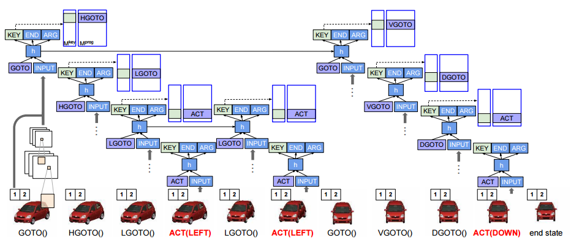

Neural Programmer-Interpreters in Tensorflow
============================================

(In progress) Tensorflow implementation of DeepMind's [Neural Programmer-Interpreters](http://arxiv.org/abs/1511.06279).

Prerequisites
-------------

- Python 2.7 or Python 3.3+
- [Tensorflow](https://www.tensorflow.org/)

Usage
-----

(in progress)

Author
------

Taehoon Kim / [@carpedm20](http://carpedm20.github.io/)
